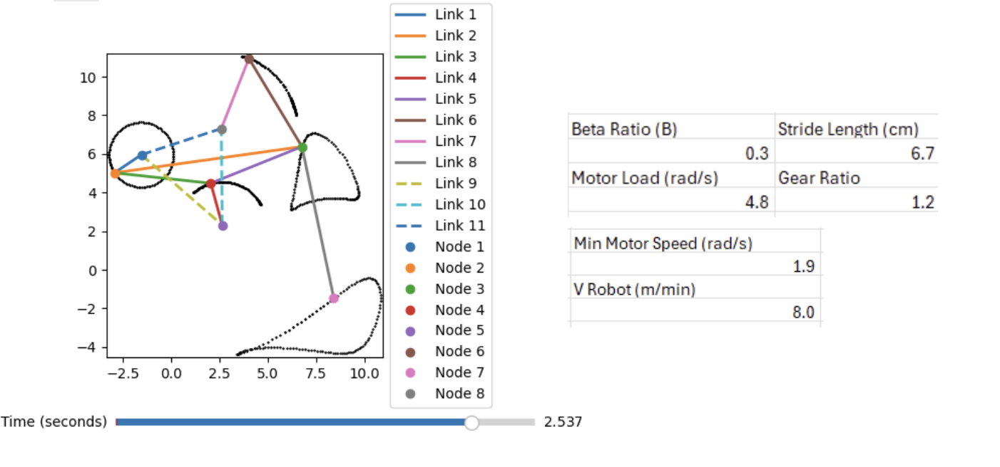

---
<div style="display: flex; gap: 20px; justify-content: center; flex-wrap: wrap;">
  
  
</div>
---


## Parts Lists
 

## Engineering Drawings


---
## Expense Report

---
## Leg Gait + PVA Simulation
<!-- Row: Gait image + YouTube video -->
<div style="display: flex; gap: 20px; flex-wrap: wrap; justify-content: center; align-items: flex-start;">
  
  <!-- Gait.png -->
  <div>
    
  </div>

  <!-- YouTube Video -->
  <div>
    <iframe width="400" height="225"
      src="https://www.youtube.com/embed/Y6XETcO8mDM"
      frameborder="0"
      allow="autoplay; encrypted-media"
      allowfullscreen>
    </iframe>
  </div>

</div>

<!-- Row: PVA.png below -->
<div style="margin-top: 20px;">
  
</div>
The robot’s legs based on PVA (Position-Velocity-Acceleration) analysis to mimic an efficient, natural gait. The motion is primarily forward-driven, as shown by the strong X-axis velocity and acceleration patterns, which minimizes wasted energy. The smooth, periodic position curves ensure stable and predictable steps, while controlled vertical motion lifts the foot just enough to clear the ground without unnecessary bouncing. This design balances power, efficiency, and stability—ideal for reliable locomotion in real-world environments.
## Reflection
Working on this project helped me grow in ways I didn’t fully expect. I had to think about design, not just in terms of how things look or fit, but how they’ll actually be built, assembled, and function in the real world. Balancing internal space, structural strength, and manufacturability made every decision feel meaningful — and sometimes tough.

I found myself revisiting and reworking details I would’ve overlooked in the past, and in doing so, I became more confident in my ability to handle complexity. I started thinking less like a student doing an assignment and more like an engineer solving a real product challenge.

This experience confirmed that mechanical design is something I genuinely enjoy, especially the process of turning rough ideas into something functional and manufacturable. It made me excited to keep learning, keep building, and keep pushing toward more ambitious projects in the future.


<!--## Embedding youtube video
The second video has the autoplay on. copy and paste the 11-digit id found in the url link. <br>
*Example* : https://www.youtube.com/watch?v={**MhVw-MHGv4s**}&ab_channel=engineerguy



you can also set up custom size by specifying the width (the aspect ratio has been set to 16/9). The default size is 560 pixels x 315 pixels.  

The width of the video below. Regardless of initial width, all the videos is responsive and will fit within the smaller screen.
  

<br>

## Adding a hozontal line
---

## Starting a new line
leave two spaces "  " at the end or enter <br>

## Adding bold text
this is how you input **bold text**

## Adding italic text
Italicized text is the *cat's meow*.

## Adding ordered list
1. First item
2. Second item
3. Third item
4. Fourth item

## Adding unordered list
- First item
- Second item
- Third item
- Fourth item

## Adding code block
```ruby
def hello_world
  puts "Hello, World!"
end
```

```python
def start()
  print("time to start!")
```

```javascript
let x = 1;
if (x === 1) {
  let x = 2;
  console.log(x);
}
console.log(x);

```

## Adding external links
[Wikipedia](https://en.wikipedia.org)


## Adding block quote
> A blockquote would look great if you need to highlight something


## Adding table 

| Header 1 | Header 2 |
|----------|----------|
| Row 1, Col 1 | Row 1, Col 2 |
| Row 2, Col 1 | Row 2, Col 2 |

make sure to leave aline betwen the table and the header-->
